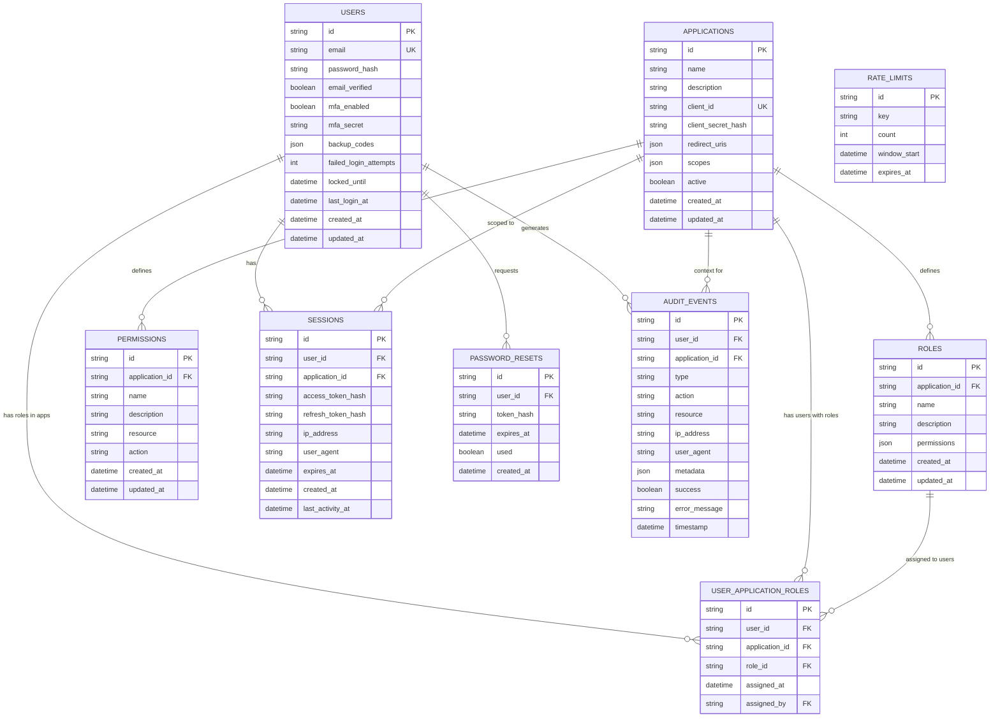

# Authentication Server Design Document

## Overview

The Authentication Server is a comprehensive, secure authentication and authorization system designed to provide enterprise-grade identity management capabilities for multiple applications. The system implements JWT-based authentication, application-specific role-based access control, multi-factor authentication, and comprehensive security monitoring using fully customized components without third-party OAuth dependencies. The server acts as a centralized identity provider that can manage users, roles, and permissions across multiple client applications with fine-grained access control.

The architecture follows a layered approach with clear separation of concerns:
- **API Layer**: RESTful endpoints for authentication and authorization operations
- **Service Layer**: Business logic and orchestration for multi-application support
- **Repository Layer**: Data access and persistence with application isolation
- **Security Layer**: Token management, encryption, and validation with application context
- **Authorization Layer**: Application-specific permission management and enforcement
- **Notification Layer**: Internal email and notification services

## Architecture

### System Overview

The Authentication Server follows a microservices-inspired layered architecture designed for scalability, security, and multi-tenancy. The system serves as a centralized identity provider for multiple client applications.

### High-Level System Architecture


### Detailed Application Architecture


### Data Flow Architecture


### Security Architecture


### Database Schema Architecture



### Deployment Architecture


### Technology Stack


### Permission Architecture

The authentication server implements a sophisticated multi-layered permission system that supports global permissions, role-based permissions, user-specific permissions, and application-specific permissions with inheritance and override capabilities.

#### Permission Hierarchy and Types


#### Permission Resolution Flow


#### Permission Data Model Architecture


#### Permission Types and Scopes


#### Permission Inheritance Model


#### Permission Evaluation Engine


#### Permission Caching Strategy


#### Permission Type Definitions

##### 1. Global Permissions
Global permissions apply across all applications and are typically reserved for system administrators.

**Examples:**
- `system.admin` - Full system administration access
- `user.management.global` - Manage users across all applications
- `application.create` - Create new applications
- `audit.view.all` - View all audit logs across applications
- `security.configure` - Configure system-wide security settings

**Use Cases:**
- Platform administrators managing the entire auth server
- Security teams monitoring all applications
- DevOps teams managing system configuration

##### 2. System Role Permissions
System roles are predefined roles with specific global permissions.

**System Roles:**
- **Super Admin**: All global permissions
- **Platform Admin**: Application and user management
- **Security Admin**: Security configuration and audit access
- **Support Admin**: Read-only access to user data and logs
- **Auditor**: Read-only access to audit logs

##### 3. Application-Specific Permissions
Permissions scoped to a specific application, defined by application owners.

**Examples:**
- `blog.post.create` - Create blog posts in the blog application
- `ecommerce.order.view` - View orders in the e-commerce application
- `crm.contact.delete` - Delete contacts in the CRM application
- `analytics.dashboard.access` - Access analytics dashboard

**Structure:**
```typescript
{
  applicationId: "app-123",
  name: "post.create",
  resource: "posts",
  action: "create",
  conditions: {
    requiresApproval: false,
    maxPerDay: 10
  }
}
```

##### 4. Role-Based Permissions
Permissions bundled into roles for easier management.

**Application Role Examples:**
- **Admin Role**: All application permissions
- **Editor Role**: Create, read, update permissions
- **Viewer Role**: Read-only permissions
- **Contributor Role**: Create and read permissions

**Role Definition:**
```typescript
{
  applicationId: "app-123",
  name: "Editor",
  permissions: [
    "post.create",
    "post.read",
    "post.update",
    "comment.moderate"
  ],
  hierarchyLevel: 2
}
```

##### 5. Direct User Permissions
Permissions assigned directly to a user, bypassing roles.

**Use Cases:**
- Temporary elevated access
- Special user privileges
- Exception handling
- Beta feature access

**Example:**
```typescript
{
  userId: "user-456",
  applicationId: "app-123",
  permissionId: "feature.beta.access",
  granted: true,
  expiresAt: "2024-12-31T23:59:59Z",
  conditions: {
    ipWhitelist: ["192.168.1.0/24"]
  }
}
```

##### 6. Permission Overrides
Explicit allow or deny rules that override inherited permissions.

**Override Types:**
- **Explicit Allow**: Grant permission even if role doesn't have it
- **Explicit Deny**: Deny permission even if role has it
- **Conditional Override**: Apply based on context (time, location, etc.)

**Example:**
```typescript
{
  userId: "user-456",
  applicationId: "app-123",
  resourceType: "sensitive-data",
  actionType: "delete",
  overrideType: "explicit_deny",
  allowOverride: false,
  reason: "User is not authorized for data deletion",
  conditions: {
    alwaysApply: true
  }
}
```

##### 7. Resource-Level Permissions
Permissions on specific resource instances (e.g., specific documents, records).

**Examples:**
- Document ownership and sharing
- Record-level access control
- Object-level permissions

**Resource Permission Model:**
```typescript
{
  resourceId: "doc-789",
  resourceType: "document",
  ownerId: "user-456",
  accessRules: {
    "user-123": ["read", "comment"],
    "user-456": ["read", "write", "delete", "share"],
    "role-editor": ["read", "write"],
    "public": ["read"]
  },
  publicAccess: false
}
```

##### 8. Context-Aware Permissions
Permissions that depend on contextual factors.

**Context Types:**
- **Time-Based**: Access only during business hours
- **Location-Based**: Access only from specific IP ranges
- **Device-Based**: Access only from approved devices
- **Condition-Based**: Access based on custom conditions

**Example:**
```typescript
{
  permissionId: "financial.data.access",
  conditions: {
    timeWindow: {
      start: "09:00",
      end: "17:00",
      timezone: "UTC",
      daysOfWeek: ["Monday", "Tuesday", "Wednesday", "Thursday", "Friday"]
    },
    ipWhitelist: ["10.0.0.0/8"],
    requiresMFA: true,
    deviceTrust: "high"
  }
}
```

#### Permission Evaluation Examples

##### Example 1: Simple Permission Check
```typescript
// User: john@example.com
// Application: blog-app
// Action: Create a blog post

// Step 1: Check global permissions
globalPermissions = [] // No global permissions

// Step 2: Check application admin role
isAppAdmin = false

// Step 3: Check application roles
userRoles = ["Editor"] // User has Editor role in blog-app
rolePermissions = ["post.create", "post.read", "post.update"]

// Step 4: Check direct permissions
directPermissions = [] // No direct permissions

// Step 5: Check overrides
overrides = [] // No overrides

// Step 6: Evaluate
hasPermission("post.create") = true // From Editor role
```

##### Example 2: Complex Permission Check with Override
```typescript
// User: jane@example.com
// Application: financial-app
// Action: Delete financial record
// Time: 2:00 AM

// Step 1: Check global permissions
globalPermissions = [] // No global permissions

// Step 2: Check application roles
userRoles = ["Admin"] // User has Admin role
rolePermissions = ["record.delete", "record.read", "record.update"]

// Step 3: Check overrides
overrides = [{
  actionType: "delete",
  overrideType: "explicit_deny",
  conditions: {
    timeWindow: { start: "09:00", end: "17:00" }
  }
}]

// Step 4: Evaluate context
currentTime = "02:00" // Outside allowed time window

// Step 5: Final decision
hasPermission("record.delete") = false // Denied by time-based override
```

##### Example 3: Multi-Application Permission Check
```typescript
// User: admin@example.com
// Applications: [app1, app2, app3]
// Action: View user data across all apps

// Step 1: Check global permissions
globalPermissions = ["user.management.global"]

// Step 2: Evaluate
hasPermission("user.view", "app1") = true // From global permission
hasPermission("user.view", "app2") = true // From global permission
hasPermission("user.view", "app3") = true // From global permission

// Global permissions grant access across all applications
```

##### Example 4: Resource-Level Permission Check
```typescript
// User: bob@example.com
// Resource: document-123
// Action: Edit document

// Step 1: Check resource ownership
resourceOwner = "alice@example.com" // Bob is not the owner

// Step 2: Check resource access rules
resourceAccessRules = {
  "bob@example.com": ["read", "comment"],
  "alice@example.com": ["read", "write", "delete", "share"]
}

// Step 3: Check application role permissions
userRoles = ["Editor"] // Has general edit permission

// Step 4: Evaluate
hasPermission("document.edit", "document-123") = false
// Resource-level permissions are more specific and deny edit access
// Bob only has read and comment access to this specific document
```

### API Architecture


## Components and Interfaces

### 1. Controllers

#### AuthController
Handles authentication-related HTTP requests.

```typescript
interface AuthController {
  register(req: RegisterRequest): Promise<RegisterResponse>
  login(req: LoginRequest): Promise<LoginResponse>
  logout(req: LogoutRequest): Promise<void>
  verifyEmail(token: string): Promise<void>
  forgotPassword(email: string): Promise<void>
  resetPassword(token: string, newPassword: string): Promise<void>
}
```

#### UserController
Manages user account operations.

```typescript
interface UserController {
  getProfile(userId: string): Promise<UserProfile>
  updateProfile(userId: string, data: UpdateProfileRequest): Promise<UserProfile>
  changePassword(userId: string, req: ChangePasswordRequest): Promise<void>
  enableMFA(userId: string): Promise<MFASetupResponse>
  verifyMFA(userId: string, token: string): Promise<void>
  getAccountActivity(userId: string): Promise<ActivityLog[]>
}
```

#### TokenController
Handles token operations.

```typescript
interface TokenController {
  refresh(refreshToken: string): Promise<TokenResponse>
  validate(accessToken: string, applicationId?: string): Promise<TokenValidationResponse>
  revoke(token: string): Promise<void>
}
```

#### ApplicationController
Manages application registration and configuration.

```typescript
interface ApplicationController {
  registerApplication(req: RegisterApplicationRequest): Promise<Application>
  getApplication(applicationId: string): Promise<Application>
  updateApplication(applicationId: string, req: UpdateApplicationRequest): Promise<Application>
  deleteApplication(applicationId: string): Promise<void>
  getApplicationPermissions(applicationId: string): Promise<Permission[]>
  assignUserRole(applicationId: string, userId: string, roleId: string): Promise<void>
  removeUserRole(applicationId: string, userId: string, roleId: string): Promise<void>
  getUserPermissions(applicationId: string, userId: string): Promise<Permission[]>
}
```

### 2. Services

#### AuthService
Core authentication business logic.

```typescript
interface AuthService {
  registerUser(email: string, password: string): Promise<User>
  authenticateUser(email: string, password: string): Promise<AuthResult>
  verifyEmailToken(token: string): Promise<void>
  sendVerificationEmail(user: User): Promise<void>
  handleFailedLogin(userId: string): Promise<void>
  checkAccountLock(userId: string): Promise<boolean>
  initiatePasswordReset(email: string): Promise<void>
  resetPassword(token: string, newPassword: string): Promise<void>
}
```

#### TokenService
Manages token lifecycle with application context.

```typescript
interface TokenService {
  generateTokenPair(user: User, applicationId?: string): Promise<TokenPair>
  refreshTokens(refreshToken: string): Promise<TokenPair>
  validateAccessToken(token: string, applicationId?: string): Promise<TokenPayload>
  revokeToken(token: string): Promise<void>
  revokeAllUserTokens(userId: string, applicationId?: string): Promise<void>
  revokeApplicationTokens(applicationId: string): Promise<void>
}
```

#### EmailService
Handles email notifications and verification.

```typescript
interface EmailService {
  sendVerificationEmail(user: User, token: string): Promise<void>
  sendPasswordResetEmail(user: User, token: string): Promise<void>
  sendSecurityAlert(user: User, event: SecurityEvent): Promise<void>
  sendMFASetupEmail(user: User, backupCodes: string[]): Promise<void>
}
```

#### MFAService
Multi-factor authentication management.

```typescript
interface MFAService {
  generateTOTPSecret(userId: string): Promise<TOTPSetup>
  verifyTOTPToken(userId: string, token: string): Promise<boolean>
  generateBackupCodes(userId: string): Promise<string[]>
  verifyBackupCode(userId: string, code: string): Promise<boolean>
}
```

#### ApplicationService
Application management and configuration.

```typescript
interface ApplicationService {
  createApplication(name: string, description: string, clientId: string): Promise<Application>
  getApplication(applicationId: string): Promise<Application>
  getApplicationByClientId(clientId: string): Promise<Application>
  updateApplication(applicationId: string, data: UpdateApplicationData): Promise<Application>
  deleteApplication(applicationId: string): Promise<void>
  validateApplicationAccess(clientId: string, clientSecret: string): Promise<Application>
}
```

#### RoleService
Role and permission management with application context.

```typescript
interface RoleService {
  createRole(applicationId: string, name: string, permissions: string[]): Promise<Role>
  assignUserRole(applicationId: string, userId: string, roleId: string): Promise<void>
  removeUserRole(applicationId: string, userId: string, roleId: string): Promise<void>
  getUserRoles(userId: string, applicationId?: string): Promise<Role[]>
  checkPermission(userId: string, permission: string, applicationId: string): Promise<boolean>
  getUserPermissions(userId: string, applicationId: string): Promise<Permission[]>
}
```

#### PermissionService
Permission management and validation.

```typescript
interface PermissionService {
  createPermission(applicationId: string, name: string, description: string, resource: string, action: string): Promise<Permission>
  getApplicationPermissions(applicationId: string): Promise<Permission[]>
  validatePermission(userId: string, applicationId: string, resource: string, action: string): Promise<boolean>
  getPermissionsByRole(roleId: string): Promise<Permission[]>
}
```

### 3. Security Components

#### JWTManager
JWT token generation and validation.

```typescript
interface JWTManager {
  generateAccessToken(payload: TokenPayload): string
  generateRefreshToken(payload: TokenPayload): string
  verifyToken(token: string): TokenPayload
  decodeToken(token: string): TokenPayload | null
}
```

#### PasswordHasher
Secure password hashing.

```typescript
interface PasswordHasher {
  hash(password: string): Promise<string>
  verify(password: string, hash: string): Promise<boolean>
  needsRehash(hash: string): boolean
}
```

#### Encryptor
Data encryption for sensitive information.

```typescript
interface Encryptor {
  encrypt(data: string): string
  decrypt(encrypted: string): string
  encryptObject<T>(obj: T): string
  decryptObject<T>(encrypted: string): T
}
```

#### RateLimiter
Request rate limiting.

```typescript
interface RateLimiter {
  checkLimit(key: string, limit: number, window: number): Promise<boolean>
  increment(key: string, window: number): Promise<number>
  reset(key: string): Promise<void>
}
```

### 4. Repositories

#### UserRepository
User data persistence.

```typescript
interface UserRepository {
  create(user: CreateUserDTO): Promise<User>
  findById(id: string): Promise<User | null>
  findByEmail(email: string): Promise<User | null>
  update(id: string, data: UpdateUserDTO): Promise<User>
  delete(id: string): Promise<void>
  incrementFailedLogins(id: string): Promise<number>
  resetFailedLogins(id: string): Promise<void>
}
```

#### TokenRepository
Token storage and management.

```typescript
interface TokenRepository {
  storeRefreshToken(token: RefreshTokenData): Promise<void>
  findRefreshToken(token: string): Promise<RefreshTokenData | null>
  revokeToken(token: string): Promise<void>
  revokeUserTokens(userId: string): Promise<void>
  cleanExpiredTokens(): Promise<number>
}
```

#### SessionRepository
Session management.

```typescript
interface SessionRepository {
  create(session: CreateSessionDTO): Promise<Session>
  findById(id: string): Promise<Session | null>
  findByUserId(userId: string): Promise<Session[]>
  update(id: string, data: UpdateSessionDTO): Promise<Session>
  delete(id: string): Promise<void>
  deleteUserSessions(userId: string): Promise<void>
}
```

#### AuditRepository
Security audit logging.

```typescript
interface AuditRepository {
  log(event: AuditEvent): Promise<void>
  findByUserId(userId: string, limit: number): Promise<AuditEvent[]>
  findByApplicationId(applicationId: string, limit: number): Promise<AuditEvent[]>
  findByType(type: string, from: Date, to: Date): Promise<AuditEvent[]>
  findSuspiciousActivity(criteria: SuspiciousActivityCriteria): Promise<AuditEvent[]>
}
```

#### ApplicationRepository
Application data persistence.

```typescript
interface ApplicationRepository {
  create(application: CreateApplicationDTO): Promise<Application>
  findById(id: string): Promise<Application | null>
  findByClientId(clientId: string): Promise<Application | null>
  update(id: string, data: UpdateApplicationDTO): Promise<Application>
  delete(id: string): Promise<void>
  findAll(): Promise<Application[]>
}
```

#### PermissionRepository
Permission data persistence.

```typescript
interface PermissionRepository {
  create(permission: CreatePermissionDTO): Promise<Permission>
  findById(id: string): Promise<Permission | null>
  findByApplicationId(applicationId: string): Promise<Permission[]>
  findByRoleId(roleId: string): Promise<Permission[]>
  update(id: string, data: UpdatePermissionDTO): Promise<Permission>
  delete(id: string): Promise<void>
}
```

#### UserApplicationRoleRepository
User-Application-Role relationship management.

```typescript
interface UserApplicationRoleRepository {
  assignRole(userId: string, applicationId: string, roleId: string): Promise<void>
  removeRole(userId: string, applicationId: string, roleId: string): Promise<void>
  findUserRoles(userId: string, applicationId?: string): Promise<UserApplicationRole[]>
  findApplicationUsers(applicationId: string): Promise<UserApplicationRole[]>
  removeAllUserRoles(userId: string, applicationId?: string): Promise<void>
  removeAllApplicationRoles(applicationId: string): Promise<void>
}
```

## Data Models

### User
```typescript
interface User {
  id: string
  email: string
  passwordHash: string
  emailVerified: boolean
  mfaEnabled: boolean
  mfaSecret: string | null  // encrypted
  backupCodes: string[] | null  // encrypted
  failedLoginAttempts: number
  lockedUntil: Date | null
  lastLoginAt: Date | null
  createdAt: Date
  updatedAt: Date
}
```

### Application
```typescript
interface Application {
  id: string
  name: string
  description: string
  clientId: string  // unique identifier for API access
  clientSecret: string  // hashed secret for authentication
  redirectUris: string[]  // allowed redirect URIs
  scopes: string[]  // available scopes for this application
  active: boolean
  createdAt: Date
  updatedAt: Date
}
```

### Permission
```typescript
interface Permission {
  id: string
  applicationId: string
  name: string  // e.g., "read_users", "write_posts"
  description: string
  resource: string  // e.g., "users", "posts", "settings"
  action: string  // e.g., "read", "write", "delete", "admin"
  createdAt: Date
  updatedAt: Date
}
```

### UserApplicationRole
```typescript
interface UserApplicationRole {
  id: string
  userId: string
  applicationId: string
  roleId: string
  assignedAt: Date
  assignedBy: string  // user ID who assigned the role
}
```

### PasswordReset
```typescript
interface PasswordReset {
  id: string
  userId: string
  token: string  // hashed
  expiresAt: Date
  used: boolean
  createdAt: Date
}
```

### Session
```typescript
interface Session {
  id: string
  userId: string
  accessToken: string
  refreshToken: string
  ipAddress: string
  userAgent: string
  expiresAt: Date
  createdAt: Date
  lastActivityAt: Date
}
```

### Role
```typescript
interface Role {
  id: string
  applicationId: string  // roles are application-specific
  name: string
  description: string
  permissions: string[]  // array of permission IDs
  createdAt: Date
  updatedAt: Date
}
```

### AuditEvent
```typescript
interface AuditEvent {
  id: string
  userId: string | null
  applicationId: string | null  // which application the event relates to
  type: string  // 'login', 'logout', 'register', 'permission_check', etc.
  action: string
  resource: string | null  // what resource was accessed
  ipAddress: string
  userAgent: string
  metadata: object
  success: boolean
  errorMessage: string | null
  timestamp: Date
}
```

### TokenPayload
```typescript
interface TokenPayload {
  sub: string  // user id
  email: string
  applicationId?: string  // application context for the token
  roles: ApplicationRole[]  // roles with application context
  permissions: ApplicationPermission[]  // permissions with application context
  iat: number
  exp: number
  type: 'access' | 'refresh'
}

interface ApplicationRole {
  applicationId: string
  roleId: string
  roleName: string
}

interface ApplicationPermission {
  applicationId: string
  permissionId: string
  resource: string
  action: string
}
```

## Correctness Properties

*A property is a characteristic or behavior that should hold true across all valid executions of a systemessentially, a formal statement about what the system should do. Properties serve as the bridge between human-readable specifications and machine-verifiable correctness guarantees.*

### Property Reflection

After analyzing all acceptance criteria, several properties can be consolidated to eliminate redundancy:

- **Serialization/Deserialization**: Multiple criteria (2.5, 3.4/3.5, 4.4/4.5, 5.4/5.5, 6.4/6.5, 7.4/7.5, 8.4, 10.4/10.5) all test round-trip serialization. These can be combined into comprehensive round-trip properties for each data type.
- **Token Generation/Validation**: Criteria 6.4 and 6.5 can be combined into a single JWT round-trip property.
- **Rate Limiting**: Criteria 9.3 and 9.4 can be combined into a single property about rate limit data consistency.

### Core Properties

**Property 1: User registration with valid credentials**
*For any* valid email and password combination, registering a user should create a new account with properly encrypted credentials and trigger email verification
**Validates: Requirements 1.1, 1.4**

**Property 2: Duplicate email prevention**
*For any* email address, attempting to register multiple users with the same email should reject subsequent registrations
**Validates: Requirements 1.2**

**Property 3: Input validation consistency**
*For any* invalid email format or weak password, the registration system should reject the input with specific validation errors
**Validates: Requirements 1.3**

**Property 4: Email verification enforcement**
*For any* unverified user account, authentication attempts should be rejected until email verification is completed
**Validates: Requirements 1.5**

**Property 5: Successful authentication token generation**
*For any* valid user credentials, successful authentication should return both access and refresh tokens with correct user claims
**Validates: Requirements 2.1**

**Property 6: Failed authentication handling**
*For any* invalid credentials, authentication should be rejected and the failed login counter should be incremented
**Validates: Requirements 2.2**

**Property 7: Account locking after failed attempts**
*For any* user account, exceeding the maximum failed login attempts should lock the account and prevent further authentication
**Validates: Requirements 2.3**

**Property 8: Session creation and audit logging**
*For any* successful authentication, a new session should be created and an audit event should be logged with complete metadata
**Validates: Requirements 2.4**

**Property 9: Credential parsing round-trip**
*For any* valid user credentials, parsing then serializing should produce equivalent credential data
**Validates: Requirements 2.5**

**Property 10: Password reset token generation**
*For any* valid email address, requesting password reset should generate a secure reset token and send reset instructions
**Validates: Requirements 3.1**

**Property 11: Password reset token validation**
*For any* valid password reset token within expiration window, the system should allow password changes
**Validates: Requirements 3.2**

**Property 12: Password reset token invalidation**
*For any* used password reset token, subsequent attempts to use the same token should be rejected
**Validates: Requirements 3.3**

**Property 13: Password reset token security**
*For any* password reset token, storing should hash the token and validation should verify both hash and expiration
**Validates: Requirements 3.4, 3.5**

**Property 14: Role assignment and session invalidation**
*For any* user and role combination, assigning a role should update permissions and invalidate existing sessions
**Validates: Requirements 4.1**

**Property 15: Permission consistency after role changes**
*For any* user with modified roles, all subsequent permission checks should reflect the new role assignments immediately
**Validates: Requirements 4.2**

**Property 16: Permission validation accuracy**
*For any* user, permission, and application combination, permission checks should accurately reflect current application-specific role assignments
**Validates: Requirements 4.3**

**Property 17: Role data round-trip**
*For any* role configuration, storing then retrieving role data should preserve all role information and user associations
**Validates: Requirements 4.4, 4.5**

**Property 18: MFA setup completeness**
*For any* user enabling MFA, the system should generate secure TOTP secrets and backup codes, storing them encrypted
**Validates: Requirements 5.1**

**Property 19: MFA enforcement during authentication**
*For any* MFA-enabled user, authentication should require both password and valid MFA token verification
**Validates: Requirements 5.2**

**Property 20: Invalid MFA token rejection**
*For any* invalid MFA token, authentication should be rejected and a security event should be logged
**Validates: Requirements 5.3**

**Property 21: MFA data encryption round-trip**
*For any* MFA configuration data, encrypting then decrypting should preserve all sensitive information securely
**Validates: Requirements 5.4, 5.5**

**Property 22: Token validation accuracy**
*For any* JWT token, validation should correctly verify signature, expiration, and return appropriate user information for valid tokens
**Validates: Requirements 6.1, 6.3**

**Property 23: Invalid token rejection**
*For any* expired or malformed token, validation should reject the token with appropriate error codes
**Validates: Requirements 6.2**

**Property 24: JWT round-trip consistency**
*For any* user claims with application context, generating a JWT then parsing it should preserve all claim information including application-specific roles and permissions
**Validates: Requirements 6.4, 6.5**

**Property 25: Refresh token exchange**
*For any* valid refresh token, the token refresh process should generate new access and refresh tokens while invalidating the old refresh token
**Validates: Requirements 7.1, 7.2**

**Property 26: Invalid refresh token handling**
*For any* expired or invalid refresh token, the system should require full re-authentication
**Validates: Requirements 7.3**

**Property 27: Refresh token encryption round-trip**
*For any* refresh token data, encrypting then decrypting should preserve token integrity and associated metadata
**Validates: Requirements 7.4, 7.5**

**Property 28: Comprehensive audit logging**
*For any* authentication event, the system should log complete metadata including timestamp, IP address, user agent, and event details
**Validates: Requirements 8.1**

**Property 29: Security alert triggering**
*For any* suspicious activity pattern, the system should trigger appropriate security alerts and protective measures
**Validates: Requirements 8.2**

**Property 30: Structured log formatting**
*For any* audit log entry, the format should be structured and searchable with all required security context
**Validates: Requirements 8.3**

**Property 31: Audit log data round-trip**
*For any* audit log entry, storing then querying should preserve all log information and support filtering by search criteria
**Validates: Requirements 8.4, 8.5**

**Property 32: Rate limiting enforcement**
*For any* request pattern exceeding configured thresholds, rate limiting should be applied with appropriate HTTP status codes
**Validates: Requirements 9.1**

**Property 33: Rate limit tracking accuracy**
*For any* series of requests, the system should accurately track request counts per IP address and user account
**Validates: Requirements 9.2**

**Property 34: Rate limit data consistency**
*For any* rate limiting counter, storing then retrieving should maintain accurate request counts and expiration times
**Validates: Requirements 9.3, 9.4**

**Property 35: Rate limit processing continuity**
*For any* rate-limited endpoint, requests within allowed limits should continue to be processed normally
**Validates: Requirements 9.5**

**Property 36: Account update validation**
*For any* account information update, the system should validate changes and persist them securely
**Validates: Requirements 10.1**

**Property 37: Password change security**
*For any* password change request, the system should verify the current password and enforce all password policy requirements
**Validates: Requirements 10.2**

**Property 38: Account activity display**
*For any* user account, viewing account activity should display recent authentication events and security actions accurately
**Validates: Requirements 10.3**

**Property 39: Application registration security**
*For any* application registration request, the system should create unique client credentials and store configuration securely
**Validates: Requirements 10.1**

**Property 40: Application authentication validation**
*For any* application authentication request, the system should validate client credentials and generate application-scoped tokens
**Validates: Requirements 10.2**

**Property 41: Application permission definition**
*For any* application permission definition, the system should store permission structures with proper resource and action mappings
**Validates: Requirements 10.3**

**Property 42: Application data round-trip**
*For any* application configuration data, storing then retrieving should preserve all application settings and permission structures
**Validates: Requirements 10.4, 10.5**

**Property 43: User-application role assignment**
*For any* user and application combination, assigning a role should create proper associations and update token permissions
**Validates: Requirements 11.1**

**Property 44: Application-specific permission validation**
*For any* user permission check within an application context, validation should reflect application-specific role assignments
**Validates: Requirements 11.2**

**Property 45: Multi-application permission isolation**
*For any* user accessing multiple applications, permissions should be properly isolated and scoped to each application
**Validates: Requirements 11.3**

**Property 46: Role assignment data round-trip**
*For any* user-application-role relationship, storing then retrieving should preserve all assignment data with audit trails
**Validates: Requirements 11.4, 11.5**

**Property 47: Account data round-trip**
*For any* user account data, updating then retrieving should preserve all account settings and information consistently
**Validates: Requirements 12.4, 12.5**

## Error Handling

### Error Categories

1. **Validation Errors**: Input validation failures, format errors, constraint violations
2. **Authentication Errors**: Invalid credentials, expired tokens, account lockouts
3. **Authorization Errors**: Insufficient permissions, role violations, access denials
4. **Rate Limiting Errors**: Request throttling, quota exceeded, temporary blocks
5. **System Errors**: Database failures, external service unavailability, internal server errors
6. **Security Errors**: Suspicious activity detection, token tampering, encryption failures

### Error Response Format

```typescript
interface ErrorResponse {
  error: {
    code: string
    message: string
    details?: object
    timestamp: string
    requestId: string
  }
}
```

### Error Handling Strategy

- **Graceful Degradation**: System continues operating with reduced functionality when non-critical services fail
- **Circuit Breaker Pattern**: Prevent cascading failures when external services are unavailable
- **Retry Logic**: Automatic retry with exponential backoff for transient failures
- **Security-First**: Never expose sensitive information in error messages
- **Comprehensive Logging**: All errors logged with sufficient context for debugging
- **User-Friendly Messages**: Clear, actionable error messages for client applications

## Testing Strategy

### Dual Testing Approach

The authentication server requires both unit testing and property-based testing to ensure comprehensive coverage:

- **Unit Tests**: Verify specific examples, edge cases, and integration points between components
- **Property-Based Tests**: Verify universal properties that should hold across all inputs using generated test data

### Property-Based Testing Framework

**Framework**: We will use **fast-check** for JavaScript/TypeScript property-based testing, which provides:
- Comprehensive data generators for various input types
- Shrinking capabilities to find minimal failing examples
- Integration with popular testing frameworks like Jest

**Configuration**: Each property-based test will run a minimum of 100 iterations to ensure thorough coverage of the input space.

**Test Tagging**: Each property-based test must include a comment explicitly referencing the correctness property from this design document using the format: `**Feature: auth-server, Property {number}: {property_text}**`

### Unit Testing Focus Areas

- **Authentication Flow Integration**: End-to-end authentication scenarios
- **Error Boundary Testing**: Specific error conditions and edge cases
- **External Service Integration**: OAuth provider interactions, email service integration
- **Security Component Integration**: Token generation, encryption, rate limiting coordination

### Property-Based Testing Implementation

Each correctness property listed above must be implemented as a single property-based test. The tests will:

1. Generate random valid inputs using fast-check generators
2. Execute the system functionality
3. Verify the expected properties hold true
4. Use shrinking to find minimal counterexamples when properties fail

### Test Coverage Requirements

- **Functional Coverage**: All authentication flows, token operations, and user management features
- **Security Coverage**: All security-critical paths including encryption, validation, and access control
- **Error Coverage**: All error conditions and recovery scenarios
- **Performance Coverage**: Rate limiting and resource management under load

